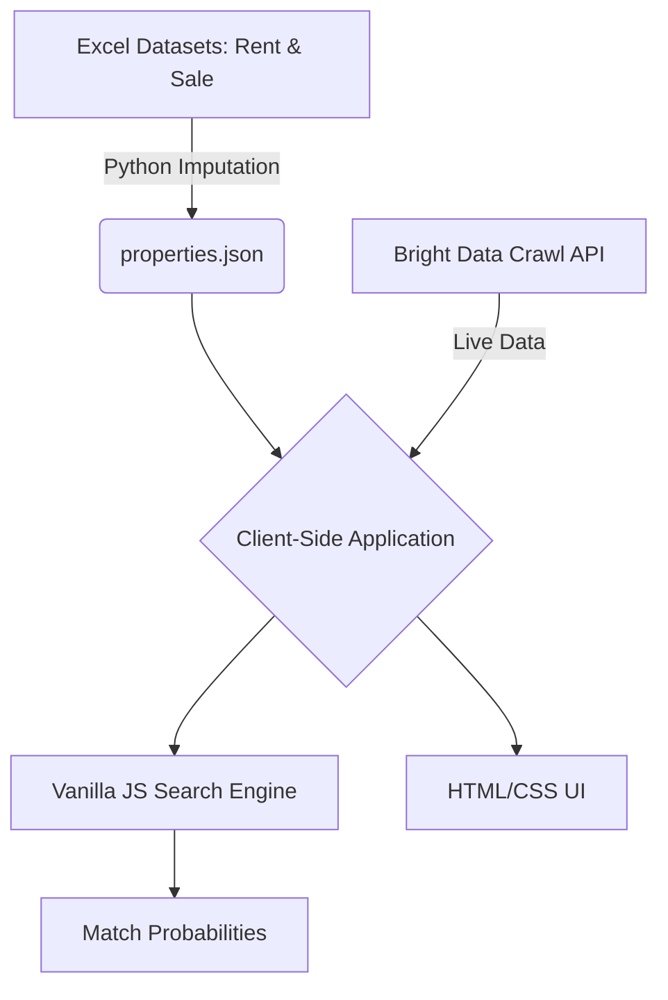

    <h1>Find Your Dream Home in Montgomery City</h1>
    <h3>AI-Powered Real Estate Assistant</h3>
    
<em>Redefining property discovery with conversational search and video tours.</em>

     
    
🏠 <strong>RealEstateAI</strong> | Montgomery, AL

---

    <h2>Slide 2: The Problem with Traditional Search</h2>

* **Rigid Filters:** Standard real estate platforms force users into strict drop-downs (Beds, Baths, ZIP) that don't capture nuance.
* **Static Images:** Photos alone fail to convey the true spatial feel of a property.
* **Overwhelming Options:** Users sift through hundreds of listings with no clear indication of exactly how well a property matches their actual desires.
* **The Result:** House hunting becomes a tedious data-entry chore rather than an exciting discovery process.

---

    <h2>Slide 3: The RealEstateAI Solution</h2>

We built an intuitive, client-side application that transforms property discovery:

* 🤖 **Conversational AI:** Describe your ideal home in plain English.
* 📊 **Smart Matching:** Algorithmically scores properties to show you the top 7 best fits.
* 🎥 **Immersive Video:** Integrates YouTube Shorts for instant property walk-throughs.
* ⚡ **Lightning Fast:** 100% client-side processing for instant results.

---

    <h2>Slide 4: AI Search & Match Probability</h2>

> "I want a 3 bedroom house for sale under $200,000"

When a user types a natural language query, our engine:
1. **Parses intent** (Sale vs. Rent, Price maximums, Room counts).
2. **Filters hard constraints** immediately.
3. **Calculates a Match Score (0-100%)** based on how closely the property aligns with the user's budget and size preferences.
4. **Ranks** and displays only the absolute best options.

---

    <h2>Slide 5: Immersive Property Tours</h2>

> *Video drastically increases engagement and buyer confidence.*

Every listing supports embedded **YouTube Shorts**:
* Gives seekers a vertical, mobile-friendly walk-through of the home.
* Keeps the user on the platform instead of linking out to external sites.
* Provides a modernized TikTok-style discovery feel for real estate.

---

    <h2>Slide 6: Seamless Interactive Listings</h2>

Our detailed property modals provide everything a buyer needs in one glance:

* **Interactive Media:** Image galleries and embedded video tours side-by-side.
* **Contextual Location:** Embedded Google Maps pinpointing the exact address in Montgomery.
* **Action-Oriented:** A prominent **"📅 Book a Tour"** CTA allows instant connection with agents.
* **Key Stats:** Clear breakdown of Price, Beds, Baths, and Area (SqFt).

---

    <h2>Slide 7: Architecture & Data Processing</h2>

* **Tech Stack:** Vanilla JavaScript, HTML5, CSS3—no heavy frameworks.
* **Data Prep:** Python automation (Pandas) to clean data and impute missing prices based on bedroom medians.
* **State:** Local database stored in lightweight JSON format.

---

    <h2>Slide 8: The Future Vision</h2>

What's next for RealEstateAI?

1. **Live Data Ingestion:** Fully connecting the Bright Data Crawl API to automatically ingest new listings every hour from Major platforms (Zillow, Realtor.com).
2. **Expansion:** Scaling the database from Montgomery, AL to cover the entire state.
3. **Generative Responses:** Integrating LLMs directly into the chat interface for conversational follow-up questions about specific properties.

     
    <strong>Thank you!</strong>

